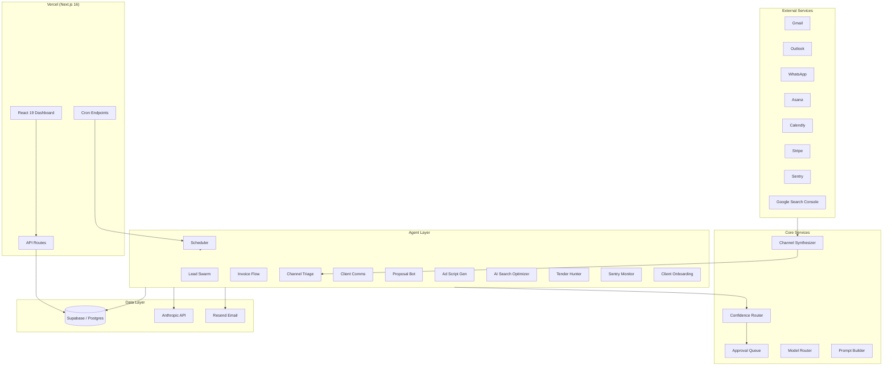
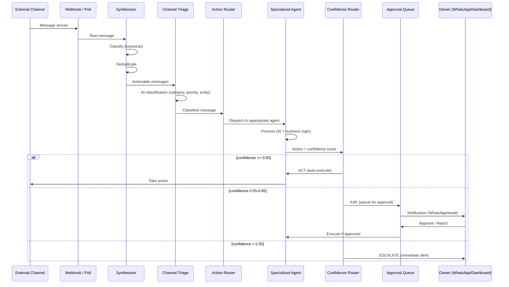
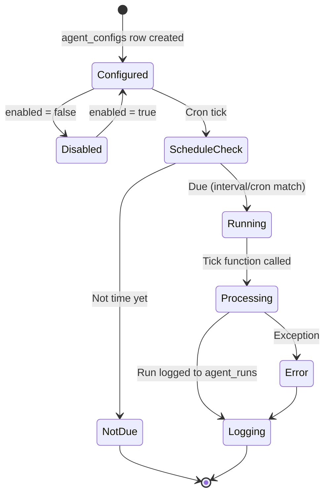

# BitBit Architecture

BitBit is an agentic AI operations platform for digital agencies. It ingests messages from multiple channels, classifies them, dispatches to specialized AI agents, and routes actions through a confidence-based approval flow.

---

## High-Level Components



---

## Data Flow: Message Ingestion to Action



---

## Agent Lifecycle



### Schedule Types

| Type | Config | Behavior |
|------|--------|----------|
| `continuous` | `{"type": "continuous"}` | Runs every scheduler tick |
| `interval` | `{"type": "interval", "interval_seconds": 300}` | Runs if N seconds since last run |
| `cron` | `{"type": "cron", "cron_expression": "0 9 * * 1-5"}` | Standard 5-field cron |

---

## Channel Pipeline

```mermaid
graph LR
    subgraph Adapters["Channel Adapters"]
        G[Gmail]
        O[Outlook]
        W[WhatsApp]
        A[Asana]
        C[Calendly]
        S[Stripe]
        GSC[GSC]
        iM[iMessage]
    end

    subgraph Synthesizer["Synthesizer Pipeline"]
        Pull[Pull Messages]
        Classify[Keyword Classification]
        Dedup[Deduplication]
        Store[Store to DB + Timeline]
    end

    subgraph Triage["AI Triage"]
        Cat[Categorize]
        Entity[Entity Resolution]
        Thread[Thread Tracking]
        Route[Route to Agent]
    end

    Adapters --> Pull
    Pull --> Classify
    Classify --> Dedup
    Dedup --> Store
    Store --> Cat
    Cat --> Entity
    Entity --> Thread
    Thread --> Route
```



---

## Confidence-Based Approval

The confidence router is the central decision gate for all agent actions.

```
Confidence Score
|
|  >= 0.85 (act threshold)     -> Auto-execute
|  >= 0.55 (ask threshold)     -> Queue for human approval
|  <  0.55                     -> Escalate immediately
|
Thresholds cascade: agent-level > org-level > defaults
```

Thresholds are configurable per-agent and per-org via `confidence_thresholds` in `agent_configs` and `organizations` tables.

---

## Model Routing

The model router selects the appropriate Anthropic model based on message complexity:

| Tier | Model | Use Case |
|------|-------|----------|
| `fast` | Claude Haiku | Simple queries, lookups |
| `balanced` | Claude Sonnet | Standard agent tasks |
| `power` | Claude Opus | Complex reasoning, proposals |

The engine auto-routes by default. Agents can override with a specific model.

---

## Key Design Patterns

### Dependency Injection
All functions accept `SupabaseClient` as their first parameter. Clients are created at the HTTP boundary (API route) and passed down. No global singletons.

### Multi-Tenancy
Every database query is scoped by `org_id`. Row Level Security (RLS) enforced at the Supabase level.

### Stateless Scheduler
The scheduler is a pure tick function with no internal state or loops. External cron (Vercel or VPS) calls it periodically. Each tick checks what is due and fires it.

### Adapter Pattern
All external channel integrations implement `ChannelAdapter` and register in the synthesizer. Adding a channel requires no changes to the core pipeline.

---

## Directory Structure

```
personal-assistant/
  src/
    app/
      api/                    # Next.js API routes
        agent/                # Agent endpoints
        billing/              # Stripe billing
        channels/             # Channel sync/relay/status
        cron/                 # Cron-triggered endpoints
        monitoring/           # Health + cost tracking
        webhooks/             # External service webhooks
      dashboard/              # Dashboard pages
    components/
      dashboard/tabs/         # Dashboard tab components
    lib/
      agent/                  # Agent implementations
        scheduler.ts          # Central scheduler
        confidence-router.ts  # Approval routing
        approval-queue.ts     # Approval queue CRUD
        engine.ts             # Chat engine (streaming)
        model-router.ts       # AI model selection
        prompt-builder.ts     # Entity-aware prompts
        tools.ts              # Agent tool definitions
      channels/               # Channel adapters
        synthesizer.ts        # Orchestrates all adapters
        types.ts              # Shared channel types
      context/                # Semantic context engine
      billing/                # Stripe integration
      email/                  # Resend email transport
      integrations/           # OAuth + credentials
      monitoring/             # Sentry + cost tracking
      onboarding/             # Org setup flows
      whatsapp/               # WhatsApp-specific helpers
      supabase/               # Supabase client helpers
```
